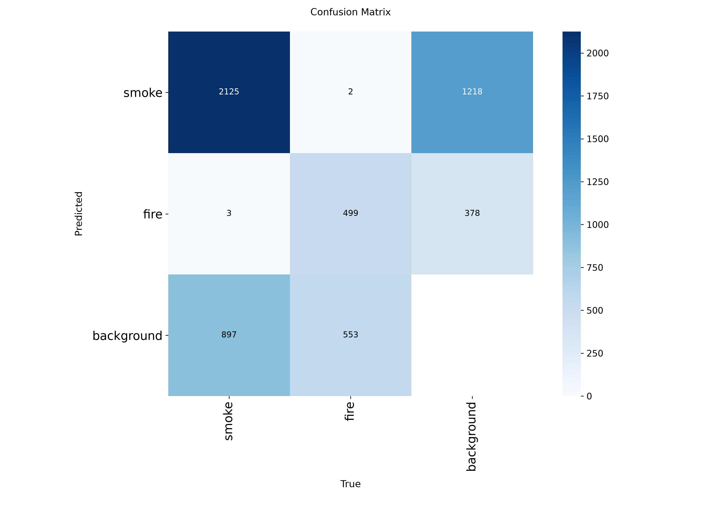
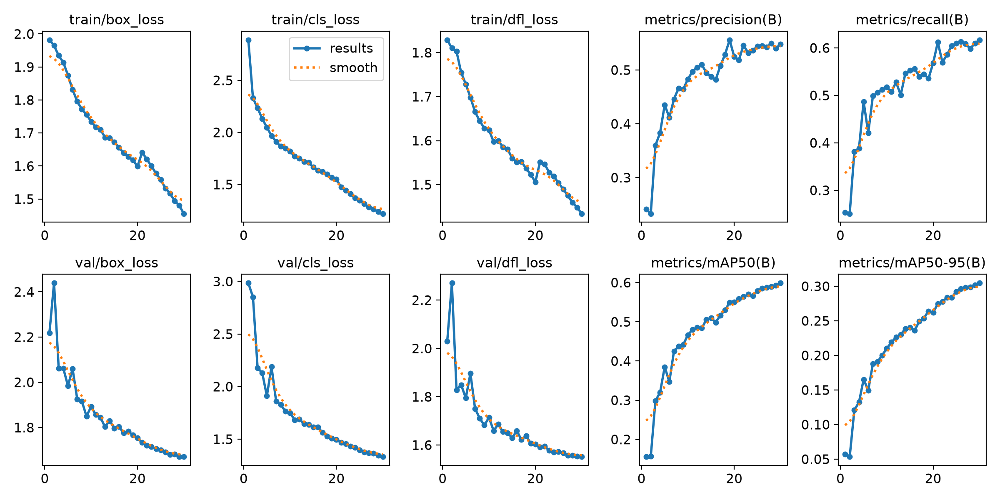
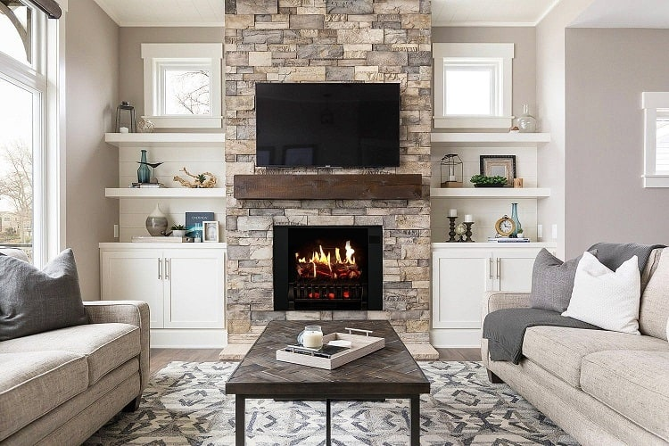
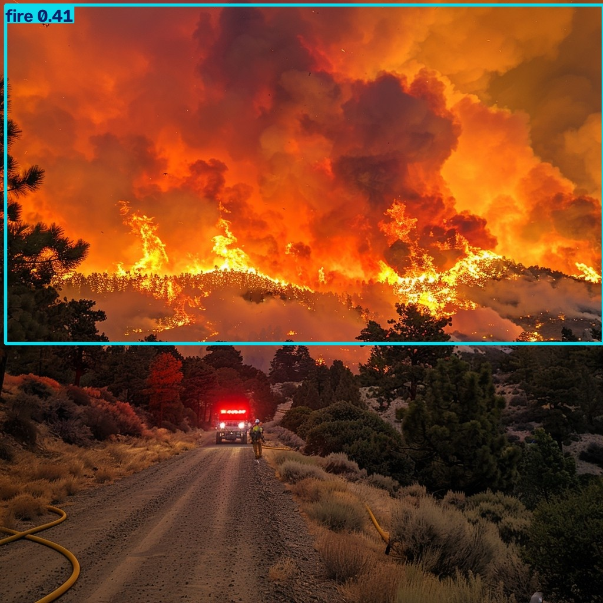
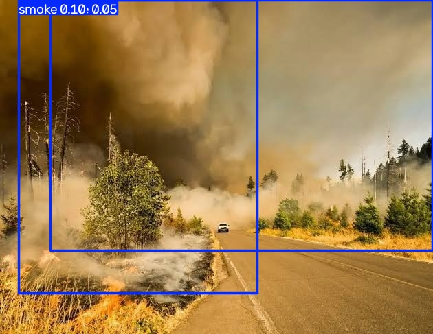
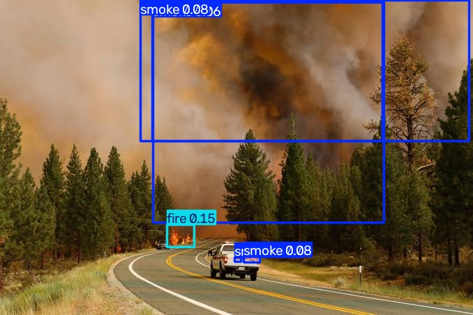

# 🌍 Real-Time Wildfire & Smoke Detection Pipeline


## 📌 Introduction & Purpose
Early wildfire detection is a critical necessity that can save lives and protect public infrastructure. I built this computer vision pipeline to evaluate environmental imagery and detect active wildfire threats autonomously. 

Building a robust machine learning model is rarely a straight line. I designed this repository to document my real-world engineering journey: testing baseline architectures, investigating why models break when exposed to tricky environmental noise, and iteratively upgrading the system across three distinct phases until it was ready for deployment.

---

## 📖 Project Overview & Background
Wildfires move fast, meaning early warning systems relying on human reports are inherently delayed. My motivation for this project was to leverage edge-deployable deep learning algorithms (specifically the YOLO family of models) to process camera feeds and detect combustion at its earliest stages. 

However, natural environments are incredibly chaotic. I quickly learned that sunsets, red brick architecture, and autumn leaves actively conspire to trick neural networks. This repository documents exactly how I solved that domain shift.

---

## 📊 Dataset Curation & Preprocessing
Sourcing environmental images, cleaning noisy data, and handling class imbalances take weeks on their own. For my final deployed model, I transitioned to a diverse dataset containing over 17,000 images curated from real-world incidents, CCTV footage, and diverse environments (urban, industrial, forest). 

Because raw dataset downloads often lack proper configuration files, I engineered an automated dataset auditing tool (`setup_and_audit.py`). This script dynamically generates the required `data.yaml` files mapping the `train`, `val`, and `test` directories, while ensuring no data leakage occurs between sets.

*(Below is the dataset distribution generated dynamically by my audit script before training)*
<br>


---

## 🔬 Model Selection & Performance Comparison: The 3 Phases

To build a production-grade system, I pushed this project through three major architectural iterations. I intentionally preserved the legacy code in this repository to showcase my debugging and analytical methodology.

### Phase 1: Semantic Segmentation (DeepLabV3+)
* **Architecture:** DeepLabV3+ with a ResNet-50 backbone.
* **The Goal:** Detect fire at the pixel level.
* **Performance & Failure:** The model suffered total class collapse. Because I lacked pristine human-annotated masks, I generated synthetic ground-truth masks using OpenCV HSV color thresholding. Natural elements like sunset skies fell into the same color thresholds as flames. The model learned a lazy shortcut, predicting "fire" for nearly every pixel and outputting a uniform pink wash across entire validation frames. 

### Phase 2: Image Classification (YOLOv8-cls)
* **Architecture:** YOLOv8 Image Classifier.
* **The Goal:** Categorize entire frames globally as "Fire" or "Non-Fire".
* **Performance & Failure:** While validation accuracy looked high (>85%) on my initial forest-heavy dataset, the model failed spectacularly in real-world edge cases due to **Global Color Bias**. When I fed it an out-of-domain image of a red-roofed Minecraft house, it flagged the architecture as a raging wildfire with 85.77% confidence. The model had learned a flawed rule: *Green = Safe, Red = Fire*. 
* **The Fix Attempt:** I engineered a Synthetic Data Augmentation pipeline (`legacy_augment_negatives.py`) to mathematically generate fake red-tinted negative images to force the model to decouple the color red from combustion. However, classification fundamentally lacks spatial awareness.

### Phase 3 (Active Pipeline): Object Detection (YOLOv8-det)
* **Architecture:** YOLOv8 Object Detection (`yolov8n.pt`).
* **The Goal:** Utilize spatial bounding boxes to detect the *specific chaotic texture* of fire and smoke, rather than analyzing global image colors.
* **Performance:** Trained locally on an **NVIDIA RTX 4050 Laptop GPU** (CUDA 12.6, PyTorch 2.14.0+cu126), the model processed 17,000+ images in roughly 2.6 hours, proving its efficiency for edge deployment.

---

## 🚧 Real-World Debugging: The Final Mile Hurdles

Phase 3 was not without severe setbacks. Getting the model to correctly identify both fire and smoke simultaneously required overcoming three major, hidden pipeline issues:

### 1. The Poisoned YAML & Gradient Collision
Initially, the model successfully detected fire but completely ignored smoke. Upon auditing the raw dataset label files (`.txt`), I discovered the ground truth mapped `0` to smoke and `1` to fire. However, my `data.yaml` listed `names: ['fire', 'smoke']`—effectively inverting the labels during training. 
* **The Failed Fix:** I attempted a 3-epoch fine-tune to force the model to relearn the correct mapping. This resulted in violent gradient collision. The neural network's weights collapsed, dropping confidence to absolute zero.
* **The Solution:** I accepted the hard truth, corrected the YAML to `names: ['smoke', 'fire']`, wiped the corrupted weights, and initiated a clean 30-epoch training run from scratch.

### 2. The YOLOv8 Directory Nesting Trap
During deployment testing, my inference scripts crashed with `FileNotFoundError`. By running recursive PowerShell path checks (`Get-ChildItem -Recurse -Filter "best.pt"`), I discovered that Ultralytics YOLO's `project="runs"` parameter was double-nesting the output directories (`runs\detect\runs\detect\train_final\weights\best.pt`). I updated the inference scripts to dynamically locate or hardcode the exact path to prevent deployment failures.

### 3. Engineering a Dual-Threshold Inference System
Once the clean model was trained, a standard confidence threshold of `conf=0.25` caught all the fire but still erased the smoke. 
* **The Physics Problem:** Smoke is inherently diffuse, fuzzy, and translucent, meaning the neural network rarely scores it above 20% confidence. Fire is bright, dense, and scores highly. If I dropped the global threshold to `0.05` to catch smoke, the model generated messy false positives for fire on anything remotely warm-colored.
* **The Engineering Fix:** I overhauled `inference_det.py` to bypass YOLO's default global threshold. I programmed a custom parsing loop that drops the base detection floor to `0.05` to capture everything, then applies independent, class-specific rules: `SMOKE_CONF_THRESH = 0.05` (to keep faint smoke) and `FIRE_CONF_THRESH = 0.25` (to strip out false-positive fire). 

---

## 📈 Final Validation Metrics
After the clean retrain and inference logic overhaul, the Phase 3 pipeline stabilized. 

* **Overall Precision:** 0.763
* **Overall Recall:** 0.647
* **Fire mAP50:** 0.697
* **Smoke mAP50:** 0.742
* **Overall mAP50:** 0.719

*(YOLOv8 dynamically generated Confusion Matrix extracted from my validation loop).*
<br>
 

*(Below is an overview of the loss convergence and metric improvements over the 30-epoch run).*
<br>


---

## 💻 Technologies Used & Why
* **Ultralytics YOLOv8:** Selected for its state-of-the-art edge-deployment capabilities. It provides inference speeds suitable for real-time camera feeds.
* **PyTorch (CUDA 12.6):** The underlying deep learning framework managing tensor computations. I utilized offline caching and GPU acceleration to drastically reduce model training cycles.
* **OpenCV:** Essential for dataset curation, synthetic data augmentation, and custom bounding-box rendering during inference.

---


---

## 📸 Real-World Evaluation & Qualitative Results

To validate the model beyond training loss metrics, the final dual-threshold pipeline was evaluated against varied real-world scenarios: large-scale canopy burns, low-density diffuse smoke plumes, multi-hazard frames, and challenging indoor edge cases with warm indoor lighting.

| Test Scenario | Annotated Model Output | Key Observations |
| :---          | :---                   | :---              |
| **Indoor Non-Hazard Baseline**<br>*(False Positive Test)* |  | **Zero False Positives:** Despite high-contrast warm lighting, stone textures, and a burning domestic fireplace, the spatial detection filter correctly suppresses non-wildfire combustion. |
| **Extreme Canopy Wildfire**<br>*(High-Intensity Hazard)* |  | **Flames Confirmed (`conf=0.41`):** Robust identification of widespread combustion across dense tree lines without false triggers on the foreground road dust. |
| **Dense Wildfire Smoke**<br>*(Low-Contrast Early Warning)* |  | **Diffuse Smoke Capture (`conf=0.05 - 0.10`):** The dual-threshold engine captures amorphous atmospheric smoke plumes that standard `0.25` thresholds erase. |
| **Combined Fire & Smoke**<br>*(Multi-Class Simultaneous)* |  | **Simultaneous Classification:** Accurately separates active tree combustion (`fire 0.15`) from rolling atmospheric plumes (`smoke 0.08`), proving decoupled class behavior. |

### Visual Analysis Summary:
* **Suppression of False Triggers:** Domestic fireplaces and incandescent living-room lighting are ignored entirely, resolving the color-bias failures encountered in Phase 2.
* **Dual-Threshold Efficacy:** Diffuse smoke (which typically scores under 15% confidence due to translucent edges) is captured alongside discrete, high-energy flames.

## 🚀 Deployment & Quick Start Guide

Packaging a model into clean inference scripts ensures it performs reliably outside of a lab environment. Here is how to run the pipeline:

### 1. Environment Setup
Clone this repository and install the dependencies:
```bash
git clone [https://github.com/AbdulWahid-1/Public-Wildfire-Smoke-Segmenter.git](https://github.com/AbdulWahid-1/Public-Wildfire-Smoke-Segmenter.git)
cd Public-Wildfire-Smoke-Segmenter
pip install ultralytics opencv-python numpy matplotlib pyyaml